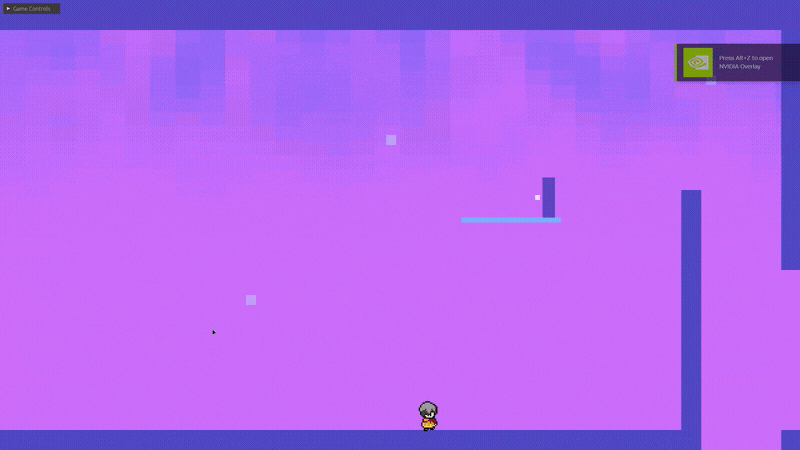
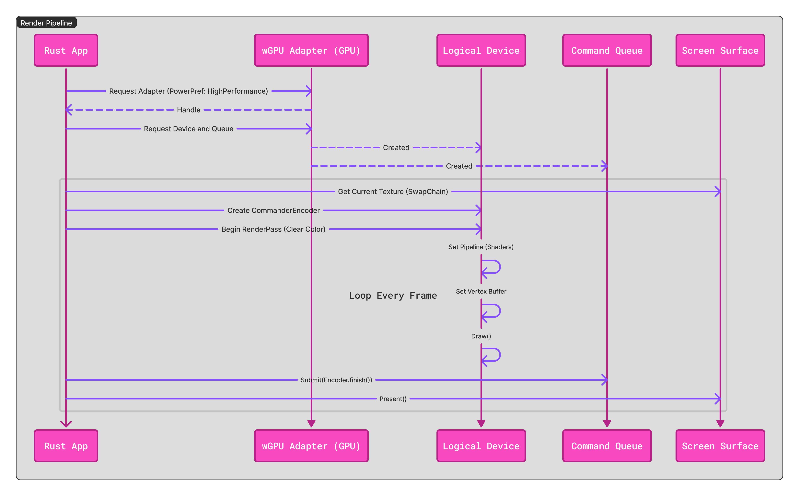

# Journey Engine, with a Fast Momentum Metroidvania Tech Demo

[](https://www.npmjs.com/package/@ujjwalvivek/journey-engine)
[](https://crates.io/crates/journey-engine)
[](https://docs.journey.ujjwalvivek.com)
[](https://github.com/ujjwalvivek/journey/actions)
[](LICENSE)

[](https://ujjwalvivek.com/blog/)

## Architectural Summary

| Category     | Details                                                    |
| ------------ | ---------------------------------------------------------- |
| Core stack   | Rust, WebAssembly, wgpu, TypeScript                        |
| Libraries    | Kira, Glam, Pollster, eGUI, Winit, Gilrs                   |
| Architecture | Data-oriented, trait-driven, fixed-step 2D engine          |
| Targets      | Native, WebAssembly                                        |
| Status       | Phase 5: MVP1 complete                                     |
| Inspiration  | Nine Sols, Sekiro, Ghostrunner, Katana Zero, Hollow Knight |

## A different take on Souls-like Metroidvania

A custom high-performance 2D game engine written in Rust + WGPU. Features AABB physics, focuses on precision platforming (_Hollow Knight_) and parry-based combat (_Sekiro_/_Nine Sols_) with a touch of a fast momentum based platformer (_Ghostrunner_). For a Metroidvania running at 60FPS (`Important Metric`) in a web browser, I want tight, deterministic, arcade physics, not realistic simulations. This project also serves as a "Living Proof of Work" for a **TPM** role.

It's all in the details. It’s not just about `Can I jump?` but `How does it feel to jump?` The secret sauce is in the mechanics that make the player feel powerful and responsive. Like coyote time, jump buffering, variable jump height, and a parry mechanic that rewards precise timing. The goal is to create a tech demo of the engine's capabilities by building a tight, fun, and responsive player controller that embodies the essence of a Fast Momentum Metroidvania gameplay.

## Cloning to Windows

1. Clone the repo with `git clone https://github.com/ujjwalvivek/journey.git`.
2. Install Rust, Node.js, and wasm-pack.
3. Press `Ctrl+Shift+B` → "Run Native (Release)".
4. Enjoy!

## Folder Architecture

The pipeline needs to be `Cross-Platform First`.

- The **"Renderer"** uses `wgpu` (which targets `Vulkan/Metal/DX12` on Desktop, and `WebGL/WebGPU` on Browser).
- The **"Input"** uses `winit` (which captures `Windows events` on Desktop, and `JS events` on Browser).

```bash
Journey/
├── Cargo.toml          //* Workspace definition
├── engine/             //* The reusable library (journey-engine on crates.io)
│   ├── src/lib.rs      //* Public API surface, GameApp trait, re-exports
│   └── Cargo.toml      //* Dependencies: wgpu, winit, kira, egui, glam, bytemuck
├── resonance/          //* The custom no_std DSP primitive (journey-sound)
├── cadence/            //* The procedural audio sequencer (journey-sequencer)
├── game/               //* The executable (Content)
│    ├── pkg/           //* WASM Artifacts (Generated here)
│    ├── src/main.rs    //* Native entry point
│    ├── src/lib.rs     //* JourneyGame: GameApp implementation
│    ├── src/input.rs   //* JourneyAction enum and key/gamepad bindings
│    └── Cargo.toml     //* Dependencies: journey-engine (aliased as engine)
└── web/                //* Vite Project for WASM distribution
    ├── src/            //* JavaScript Glue Code
    ├── package.json    //* NPM Dependencies
    └── vite.config.ts  //* WASM Configuration

```

This forces a clean API from `engine` to `game`. It also allows the engine to be published as an independent crate (`journey-engine`) for reuse, testing, and documentation, and prevents spaghetti coupling. All crates are to be `WASM-compatible`. `Pollster` for async main, and `Kira` for audio. More have been mentioned in the badges above.

### Native: Build and Run

1. Make Rust changes in `engine/` or `game/`
2. Press `Ctrl+Shift+B` to build + run.

### Web: Build and Run

**Full rebuild (Rust + TS changes):**

1. Make changes in `engine/` or `web/src/`
2. Run task "Run Web Dev Server"
3. Vite will rebuild WASM + serve at localhost:5173

**Quick iteration (TS/HTML only):**

1. Make changes in `web/src/` (no Rust changes)
2. Run task "Quick Web Dev (skip WASM rebuild)"
3. Vite hot-reloads instantly

### Tips

- Rust Analyzer will run clippy automatically on save.
- Format on save is enabled for both Rust and TypeScript.
- `target/`, `node_modules/`, `dist/`, and `Cargo.lock` are hidden from file explorer.
- The default task (`Ctrl+Shift+B`) is "Run Native (Debug)" which is fastest for iteration.

> You might want to run "Run Native (Release)" for more accurate performance testing since debug builds can be very slow.

## Success Criteria (MVP)

- **Performance:** 60 FPS stable on both Desktop and Chrome/Firefox/Safari.
- **Size:** WASM binary under 5MB (gzip). Keep it lean. Hopeful.
- **Gameplay:** Fast Momentum Metroidvania feel.
- **Code Quality:** No `unwrap()` in the main loop and clean separation between Engine and Game.

## The Roadmap

### v1.0.0 Released (Check the [Release Notes](RELEASE_NOTES.md) for details)

### Interim

- [ ] Plan for future features and create a roadmap for MVP2.

## Media and Resources




## Docs

- [Rust + WASM Book](https://rustwasm.github.io/docs/book/)
- [The Rust Book](https://doc.rust-lang.org/)
- [wgpu Docs](https://docs.rs/wgpu/latest/wgpu/)
- [Game Programming Patterns](http://gameprogrammingpatterns.com/)
- [Engine API Guide](https://github.com/ujjwalvivek/journey/blob/main/docs/src/ENGINE_API.md)
- [Technical Documentation](https://github.com/ujjwalvivek/journey/blob/main/docs/src/TECHNICAL_DOCUMENTATION.md)
- [Procedural Audio Documentation](https://github.com/ujjwalvivek/journey/blob/main/docs/src/AUDIO.md)
- [Post-Mortem Blog Post](https://ujjwalvivek.com/blog/)
