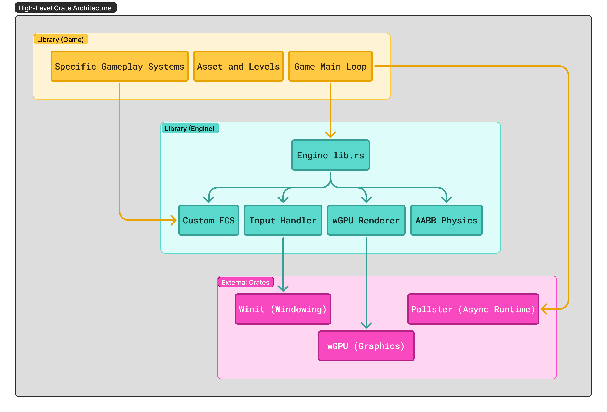
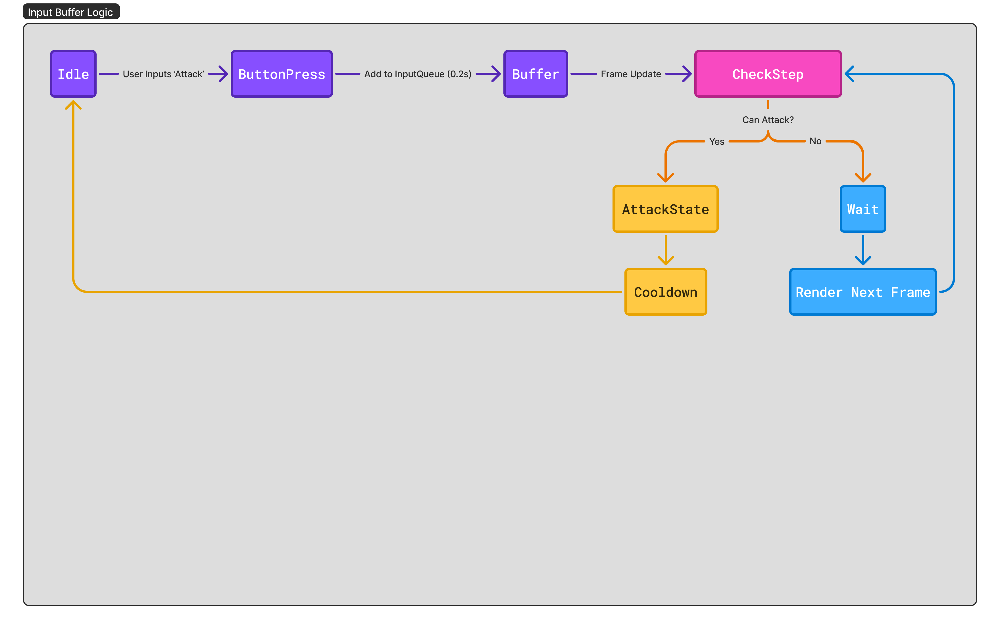

# Journey Engine - Handcrafted in Rust

## Architectural Summary

| **Core Stack**   | Rust, wGPU (WebGPU), Winit, WASM                           |
| **Physics**      | Glam, Nalgebra                                             |
| **Architecture** | Custom ECS (Entity Component System), Data-Oriented Design |
| **Target**       | Native (Dev) + WebAssembly (Distribution)                  |
| **Status**       | **Phase 5: MVP1 Complete**                                 |
| **Inspiration**  | Nine Sols, Sekiro, Ghostrunner, Katana Zero, Hollow Knight |

## A different take on Souls-like Metroidvania

A custom high-performance 2D ECS game engine written in Rust + WGPU. Features AABB physics, focuses on precision platforming (*Hollow Knight*) and parry-based combat (*Sekiro*/*Nine Sols*) with a touch of a fast momentum based platformer (*Ghostrunner*). For a Metroidvania running at 60FPS (`Important Metric`) in a web browser, I want tight, deterministic, arcade physics, not realistic simulations. This project also serves as a "Living Proof of Work" for a **TPM** role.

It's all in the details. It’s not just about `Can I jump?` but `How does it feel to jump?` The secret sauce is in the mechanics that make the player feel powerful and responsive. Like coyote time, jump buffering, variable jump height, and a parry mechanic that rewards precise timing. The goal is to create a tech demo of the engine's capabilities by building a tight, fun, and responsive player controller that embodies the essence of a Fast Momentum Metroidvania gameplay.

## Folder Architecture

The pipeline needs to be `Cross-Platform First`.

- The **"Renderer"** uses `wgpu` (which targets `Vulkan/Metal/DX12` on Desktop, and `WebGL/WebGPU` on Browser).
- The **"Input"** uses `winit` (which captures `Windows events` on Desktop, and `JS events` on Browser).

```bash
Journey/
├── Cargo.toml          //* Workspace definition
├── engine/             //* The reusable library (Product)
│   ├── src/lib.rs      //* ECS, Renderer, Input, Physics
│   └── Cargo.toml      //* Dependencies: wgpu, winit, bytemuck
├── game/               //* The executable (Content)
│    ├── pkg/           //* WASM Artifacts (Generated here)
│    ├── src/main.rs    //* Level design, Player stats, Assets
│    └── Cargo.toml     //* Dependencies: engine
└── web/                //* Vite Project for WASM distribution
    ├── src/            //* JavaScript Glue Code 
    ├── package.json    //* NPM Dependencies
    └── vite.config.js  //* WASM Configuration

```

This forces a clean API from `engine` to `game`. It also allows `engine` to be compiled as a separate crate for testing and documentation and prevents spaghetti coupling.

All crates are to be `WASM-compatible`.

- **`pollster`**: This will be used for the `main()` function. Native Rust supports async main, but WASM is complicated. This will help block the thread safely to make async code feel synchronous where needed.
- **`console_error_panic_hook`**: Crucial for Web. If the game crashes in the browser, this pipes the Rust panic message to the Chrome DevTools console.

## Success Criteria (MVP)

- **Performance:** 60 FPS stable on both Desktop and Chrome/Firefox/Safari.
- **Size:** WASM binary under 5MB (gzip). Keep it lean.
- **Gameplay:** Fast Momentum Metroidvania feel.
- **Code Quality:** No `unwrap()` in the main loop and clean separation between Engine and Game.

## The Roadmap

### Phase 1,2,3,4: Completed

### Phase 5: Wrapping up v1.0.0

- [ ] Polish the level design to showcase the mechanics effectively.
- [ ] Prepare the project with a technical documentation.
- [ ] Document the `engine` API with examples for how to use it in `game`.
- [ ] Write a post-mortem blog post detailing the development process, challenges faced, and lessons learned.
- [ ] Plan for future features (e.g., particle system, audio engine, networking) and create a roadmap for version 2.0.

## Media and Resources






## Docs

- [Rust + WASM Book](https://rustwasm.github.io/docs/book/)
- [The Rust Book](https://doc.rust-lang.org/)
- [wgpu Docs](https://docs.rs/wgpu/latest/wgpu/)
- [Game Programming Patterns](http://gameprogrammingpatterns.com/)
