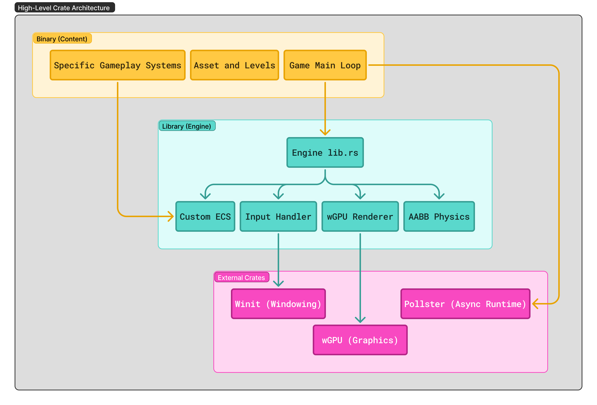
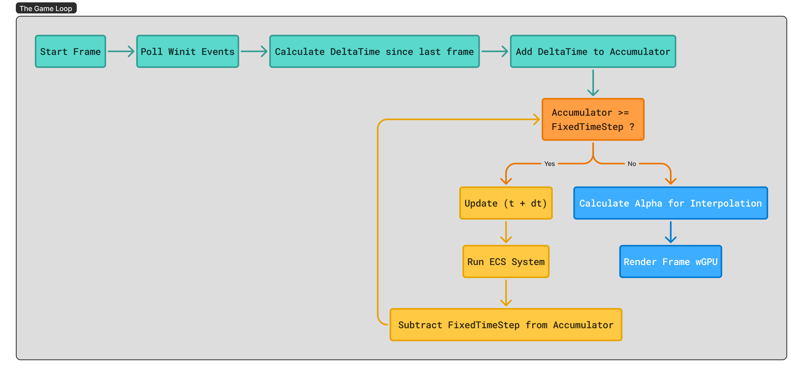

# Journey - Technical Design Document (TDD)

### Architectural Summary

| **Owner**        | Ujjwal Vivek (Technical Product Manager)                   |
| ---------------- | ---------------------------------------------------------- |
| **Core Stack**   | Rust, wGPU (WebGPU), Winit, WASM                           |
| **Physics**      | Glam, Nalgebra                                             |
| **Architecture** | Custom ECS (Entity Component System), Data-Oriented Design |
| **Target**       | Native (Dev) + WebAssembly (Distribution)                  |
| **Status**       | **Phase 0: Initialization**                                |

# Vision

A custom high-performance 2D ECS game engine written in Rust + WGPU, developed using the `Extraction Method: build a game, extract the engine`. Features AABB physics, focuses on precision platforming (*Hollow Knight* feel) and parry-based combat (*Sekiro*/*Nine Sols* mechanics). For a Metroidvania running at 60FPS (`Important Metric`) in a web browser, I want tight, deterministic, arcade physics, not realistic simulations.

### AABB Collision: 
Implement `Axis-Aligned Bounding Box `collision. It’s just math `if rect1.x < rect2.x + width ..`. This is perfect for pixel art and 2D platformers.

```rust
fn check_collision(a: Rect, b: Rect) -> bool {
    return (a.min_x < b.max_x) && (a.max_x > b.min_x) &&
           (a.min_y < b.max_y) && (a.max_y > b.min_y);
}

// Calc Tentative Pos x + dx, y + dy
// Zero out Velocity on collision axis.
```

### ECS (The Core)
Build my own ECS. (Or, `hecs`)
- **Entities**: Just an ID ( u32 ).
- **Components**: struct Position { x: f32, y: f32 }, struct Velocity { x: f32, y: f32 }.
- **Systems**: fn movement_system(query: Query<(&mut Position, &Velocity)>).
- **Note**: Iterate over entities while mutating them.

### The **"Soulslike"** Feel
It's all in the details. It’s not just about "Can I jump?" but "How does it feel to jump?" The "Secret Sauce" is in the mechanics that make the player feel powerful and responsive.
- **Coyote Time**: Allow jumping for 0.1s after walking off a ledge.
- **Jump Buffering**: If I press 'Jump' 0.1s before hitting the ground, execute it on landing.
- **Variable Jump Height**: Tap 'A' for a hop, hold 'A' for a leap.
- **Parry Mechanic**: If I press 'Parry' within 0.2s of an enemy attack, I negate damage and stagger the enemy.
  - Nine Sols, Sekiro-style deflection.
  - This is the "Secret Sauce" that makes the combat feel rewarding and skill-based.
  - State Machine: PlayerState enum contains Idle, Run, Jump, Attack, ParryActive, ParryRecovery.
- **Hurtbox**: The area where the player takes damage.
- **Hitbox**: The area where the sword deals damage.
- **Parrybox**: A special box that, if it overlaps an enemy Hitbox within 0.2s, triggers the "Clang" effect and negates damage.

### To build an engine or to build a game? The "Chicken or the Egg" Dilemma
**The Extraction Method:**
I do not build an engine. I build a game, and then I steal the engine from it.
- **Step 1 (The Hardcode)**: Write "Spaghetti Code" to get a character moving. Hardcode the gravity. Hardcode the sprite path.
- **Step 2 (The Refactor)**: I realize, "Wait, the enemy needs gravity too." So I extract the gravity logic into a `PhysicsSystem`.
- **Step 3 (The Abstraction)**: I realize, "Wait, I have 50 sprites." So I extract the sprite loading into a `ResourceManager`.

By the time I finish the game, the code that is left over (`physics`, `rendering`, `input handling`, etc.) THAT wil be my Engine.

### The Strategic Alignment (Why this exists)

This project serves as a "Living Proof of Work" for a **Systems Architect / TPM** role. It demonstrates:

* **Low-Level Mastery:** Manual memory management and borrow checker discipline (Rust).
* **Graphics Pipeline Knowledge:** Raw WGPU implementation (Vertex/Fragment shaders, Render Passes) rather than using a high-level engine.
* **Systems Architecture:** Designing a custom ECS to manage data locality and performance.
* **Cross-Platform Engineering:** Managing the complexity of Native vs. WASM build targets.

# Target Platform Analysis

**Native Benefit**: Deep Engineering Cred. If I build a native engine that runs at 144Hz with raw Vulkan/DirectX (via wgpu), I prove I understand hardware.

**Web Benefit**: Distribution. No recruiter or CTO is going to download engine.exe from my GitHub. It’s a security risk, and they are lazy. But if I send them a link to engine.ujjwalvivek.com and it runs a 60FPS Metroidvania in their browser? Instant win.

The Systems Architect Move: Do both. This is the beauty of Rust. I write the logic once.
- The **"Renderer"** uses `wgpu` (which targets `Vulkan/Metal/DX12` on Desktop, and `WebGL/WebGPU` on Browser).
- The **"Input"** uses `winit` (which captures `Windows events` on Desktop, and `JS events` on Browser).

If I architect this correctly (separating the `Platform Layer `from the `Game Logic`), I get a Native build for my ego and a Web build for my portfolio. Stick to the Web (`WASM`) target as my priority because it forces me to write clean, portable code (which looks great on a resume). But develop it locally as a Native app for speed.

# Technical Architecture

The pipeline needs to be `Cross-Platform First`.

Here is the exact **Systems Architect Workflow** for building `Journey`.

### The Architecture: The "Workspace" Pattern

**Folder Structure:**

```bash
Journey/
├── Cargo.toml          // Workspace definition
├── engine/             // The reusable library (Product)
│   ├── src/lib.rs      // ECS, Renderer, Input, Physics
│   └── Cargo.toml      // Dependencies: wgpu, winit, bytemuck
├── game/               // The executable (Content)
│    ├── src/main.rs    // Level design, Player stats, Assets
│    └── Cargo.toml     // Dependencies: engine
└── web/                // Vite Project for WASM distribution
    ├── pkg/            // WASM Artifacts (Generated here)
    ├── src/            // JavaScript Glue Code 
    ├── package.json    // NPM Dependencies
    └── vite.config.js  // WASM Configuration

```

This forces a clean API from `engine` to `game`. It also allows `engine` to be compiled as a separate crate for testing and documentation and prevents spaghetti coupling.

### Tech Stack and Dependencies

All crates should be `WASM-compatible`.
* **`winit`**: The industry standard for window creation. It abstracts the "Browser Window" and the "Desktop Window" into one unified object.
* **`wgpu`**: The graphics powerhouse. It translates the Rust code into **Vulkan/DX12** (Native) and **WebGL2/WebGPU** (Browser) automatically.
* **`pollster`**: This will be used for the `main()` function. Native Rust supports async main, but WASM is complicated. This will help block the thread safely to make async code feel synchronous where needed.
* **`console_error_panic_hook`**: Crucial for Web. If the game crashes in the browser, this pipes the Rust panic message to the Chrome DevTools console.

### The Custom ECS (Entity Component System)

I will **not** use `specs` or `bevy_ecs` initially. I will build a native ECS using Contiguous Memory to enforce understanding of **Data-Oriented Design**.
* **Entities:** Simple `u32` IDs.
* **Components:** Struct-of-Arrays (SoA) or `HashMap<EntityID, Component>` for initial simplicity.
* **Systems:** Functions that iterate over component queries (e.g., `fn physics_system(pos: &mut Position, vel: &Velocity)`).

```bash
[ World Struct ]
   |
   +-- [ Entities (Vec<u32>) ]  : [ 0, 1, 2, 3 ... ]
   |
   +-- [ Component Stores ]
         |
         +-- Positions (Vec<Pos>): [ {x,y}, {x,y}, {x,y} ... ]
         |                          ^ tightly packed for CPU cache
         |
         +-- Velocities (Vec<Vel>): [ {dx,dy}, None, {dx,dy} ... ]
                                    ^ 'None' if Entity 1 has no velocity
```

```rust
fn physics_system(world: &mut World) {
    // Iterate ONLY strictly packed data
    // The borrow checker ensures we don't mutate 'world' elsewhere
    for (pos, vel) in world.query::<(&mut Position, &Velocity)>() {
        pos.x += vel.x * dt;
        pos.y += vel.y * dt;
    }
}
```

### The Development Cycle Loop

**A. The Fast Loop (90% of time):**
* **Target:** Native (Windows/Mac/Linux).
* **Command:** `cargo run -p game`
* **Why:** Instant compile times, `println!` debugging works perfectly, full IDE support, real-time memory profiling.

**B. The Sanity Check (10% of your time):**
* **Target:** `wasm32-unknown-unknown`.
* **Command:** `cargo build --target wasm32-unknown-unknown`
* **Why:** At the end of every coding session. 
* *Critical Trap:* Some Rust crates (libraries) rely on C-bindings or OS-specific threads that **do not work** in WASM. If I wait 2 weeks to check, I might have to rewrite the whole physics system.

**C. The Showcase Build (Distribution):**
* **Target:** Web Assembly.
* **Command:** `wasm-pack build --target web`
* **Tooling:** Use a simple HTTP server (like `python3 -m http.server`) to test the `.wasm` file locally. Then deploy to my website (e.g., `engine.ujjwalvivek.com`) using Cloudflare Pages.

### Risk and Mitigation

* Keep shaders (WGSL) simple. Stick to standard scaling and coloring. Do not get fancy with compute shaders yet.
* Implement **Delta Time (`dt`)** immediately.
  * On Native: `dt` is the time since the last frame.
  * On Web: `requestAnimationFrame` controls the loop.
  * physics should be consistent regardless of frame rate.

### Success Criteria (MVP)

* **Performance:** 60 FPS stable on both Desktop and Chrome/Firefox/Safari.
* **Size:** WASM binary under 5MB (gzip). May increase if I add more features, but keep it lean.
* **Gameplay:** Souls-like Metroidvania feel.
* **Code Quality:** No `unwrap()` in the main loop and clean separation between Engine and Game.

# The Roadmap (Phases)

### Pipeline Setup

```bash
# 1. Install the WASM target
rustup target add wasm32-unknown-unknown

# 2. Install the bundler tool
cargo install wasm-pack

# 3. Create the project
cargo new --lib engine
cargo new --bin game

# 4. Setup the Workspace in root Cargo.toml
[workspace]
members = ["engine", "game"]
```

### Phase 1: The "Systems" Layer (Weeks 1-2)

*Goal: A generic black window that renders a moving colored rectangle.*

* [ ] **Initialize Workspace:** Setup `engine` (lib) and `game` (bin).
* [ ] **The Loop:** Implement the `winit` event loop with a fixed timestep (Delta Time).
* [ ] **The Renderer (WGPU):**
* Setup `Instance`, `Surface`, `Adapter`, `Device`, `Queue`.
* Create a basic Render Pipeline (Shaders -> Swapchain).
* Draw a single square (Character) (Hardcoded vertices).
* [ ] **The ECS Baseline:** Implement a basic `World` struct that can hold `Position` components.

### Phase 2: The "Platformer" Physics (Week 3)

*Goal: A rectangle that falls, hits a floor, and jumps with "tight" control.*

* [ ] **AABB Collision:** Implement Axis-Aligned Bounding Box detection.
* [ ] **Gravity & Velocity:** Implement semi-implicit Euler integration.
* [ ] **The "Feel" (Metroidvania Tuning):**
* **Coyote Time:** Allow jumping 0.1s after leaving a ledge.
* **Jump Buffering:** Register jumps pressed 0.1s before landing.
* **Variable Jump Height:** Short tap vs. Long hold processing.

### Phase 3: The Combat (Week 4)

*Goal: Implementing the "Clang" (Parry).*

* [ ] **State Machine:** Implement `PlayerState` enum (`Idle`, `Attack`, `ParryWindow`, `Stun`).
* [ ] **Hitbox Architecture:** Separate `Hurtbox` (Body) from `Hitbox` (Weapon).
* [ ] **Parry Logic:** Create a window (e.g., 12 frames) where overlapping an enemy `Hitbox` triggers a "ParrySuccess" event instead of "Damage".

### Phase 4: The Extraction (Refactor)

*Goal: Cleaning the Engine.*

* [ ] Move all specific "Game Logic" (Player stats, Level layout) to `game/`.
* [ ] Ensure `engine/` has zero hardcoded game data.
* [ ] Finalize the API for the "Engine" crate.

# Media and Resources





# References
- [wasm-pack](https://rustwasm.github.io/wasm-pack/)
- [Vite](https://vitejs.dev/)
- [Rust + WASM Book](https://rustwasm.github.io/docs/book/)
- **Inspiration:** Hollow knight Series, Nine Sols, Sekiro, Dead Cells, Ori Series, Celeste, Blasphemous, Ender Lilies.